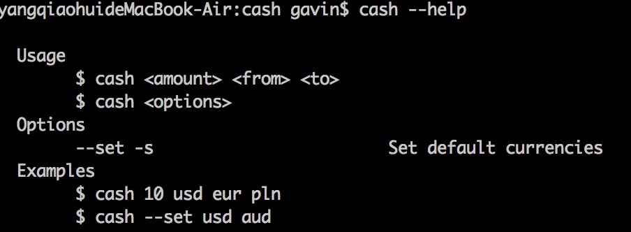
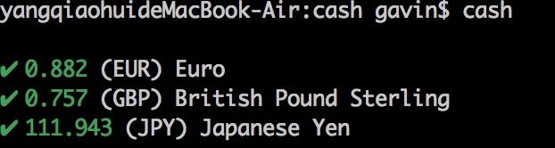
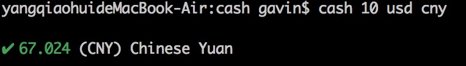

 
**Table of Contents**  

- [Introduction](#Introduction)
- [Dependencies](#Dependencies)
- [Modules](#Modules)
- [How to do](#How-to-do)
  - [Step 1](#Step-1)
  - [Step 2](#Step-2)
  - [Step 3](#Step-3)

## Introduction
this is a currency conversion tool which can be used to calculate exchange rate between differant currencies according to Real-time currency

## Dependencies
there are some dependencies to be installed:
```json
	"dependencies": {
		"chalk": "^2.4.2",
		"conf": "^2.2.0",
		"got": "^9.6.0",
		"meow": "^5.0.0",
		"money": "^0.2.0",
		"ora": "^3.2.0"
	}
```
## Modules
constants.js . 
this module include some configuration parameter . 
  
index.js . 
this module is used to read parameter from user inputing,you can think it's a entrence . 
  
constants.js . 
this module is used to calculate currencies . 
   
## How to do . 

### Step 1 . 
Getting help about parameter
```sh
cash --help
```

### Step 2
you can get defaul currencies from USD to (eur, gbp, jpy)
```sh
cash
```

### Step 3
you can calculates the exchange rate for the specified currency
```sh
cash 10 usd cny
```


## dependencies
在使用中有任何问题，欢迎反馈给我，可以用以下联系方式跟我交流

* 邮件(dev.hubo#gmail.com, 把#换成@)
* QQ: 287759234
* weibo: [@草依山](http://weibo.com/ihubo)
* twitter: [@ihubo](http://twitter.com/ihubo)

## 捐助开发者
在兴趣的驱动下,写一个`免费`的东西，有欣喜，也还有汗水，希望你喜欢我的作品，同时也能支持一下。
当然，有钱捧个钱场（右上角的爱心标志，支持支付宝和PayPal捐助），没钱捧个人场，谢谢各位。

## Thank you
感谢以下的项目,排名不分先后

* [mou](http://mouapp.com/) 
* [ace](http://ace.ajax.org/)
* [jquery](http://jquery.com)

# installation

```javascript
  var ihubo = {
    nickName  : "草依山",
    site : "http://jser.me"
  }
```
